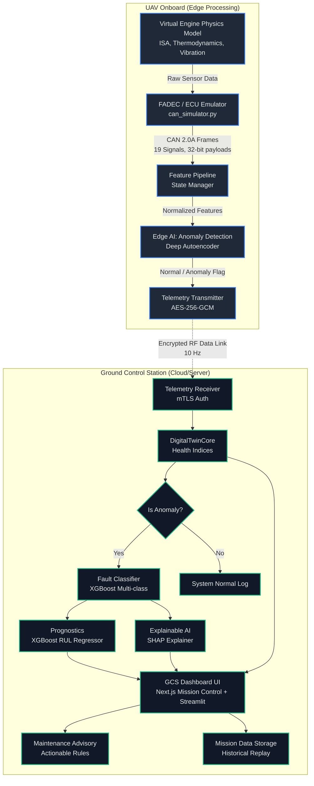

# Digital Twin Architecture Design (DRDO SIH-26054)

This document outlines the end-to-end architecture of the AI-Enabled Real-Time Digital Twin System for Aero Piston Engines (Rotax 912 ULS), split between the UAV Onboard Edge and the Ground Control Station (GCS).

## High-Level Architecture Diagram

## Component Breakdown

### 1. UAV Onboard (Edge)
- **Virtual Engine (Phase 1):** Simulates the Rotax 912 ULS with first-principles physics (Newton's cooling law, Otto Cycle efficiency, ISA atmosphere). It injects physically realistic degradation curves for 8 FMEA fault modes.
- **FADEC/ECU (Phase 1):** Encodes 19 continuous telemetry signals into standard CAN 2.0A bus frames using 11-bit arbitration IDs.
- **Edge AI (Phase 7):** A highly quantized Deep Autoencoder model evaluates the data locally in under `0.1 ms`. It emits a binary "Anomaly / Normal" flag to save telemetry bandwidth.

### 2. Telemetry Link
- **Security:** AES-256-GCM encryption with Mutual TLS (mTLS).
- **Rate:** 10 Hz telemetry frames.

### 3. Ground Control Station (GCS)
- **Digital Twin Core (Phase 2):** Continuously derives 4 key health indices (Thermal Load, Electrical Health, Combustion Quality, Lubrication Health) using strict rule-based logic anchored to the Rotax manual.
- **Fault Classifier (Phase 3):** An XGBoost classifier identifies exactly which of the 8 FMEA faults is occurring.
- **Prognostics (Phase 4):** An XGBoost regressor estimates the Remaining Useful Life (RUL) in cycles.
- **Explainable AI (XAI):** SHAP values are extracted to provide human-readable causality for the ML predictions.
- **Dashboard (Phase 6):** A Next.js Mission Control (`gcs-app`) presents a Three.js MALE UAV/engine simulation, live engine status, FMEA diagnosis, SHAP drivers, RUL, CAN frames, mission scenarios, replay, and maintenance advisory. The Streamlit dashboard remains available for analytical exploration and model validation.

## Edge vs. Cloud Rationale
By placing the **Anomaly Detection** on the edge, the UAV only needs to transmit full high-frequency diagnostic packets when an anomaly is detected, drastically reducing bandwidth requirements. The heavier, resource-intensive **XGBoost classifiers, RUL regressors, and SHAP explainers** reside on the GCS where computing power is abundant.
